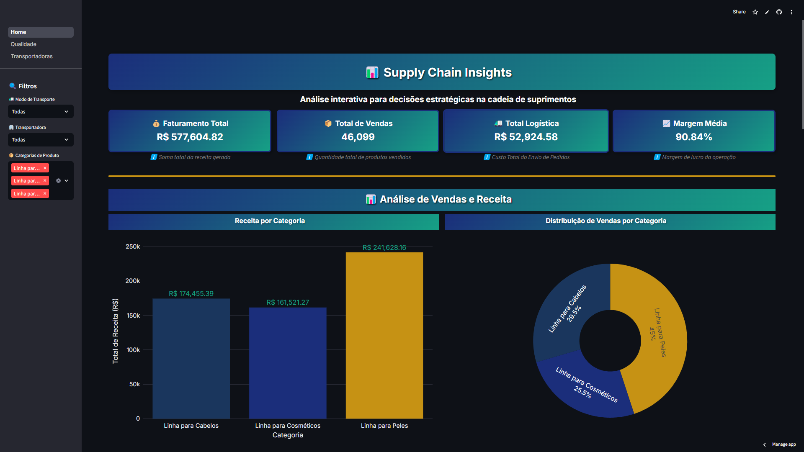
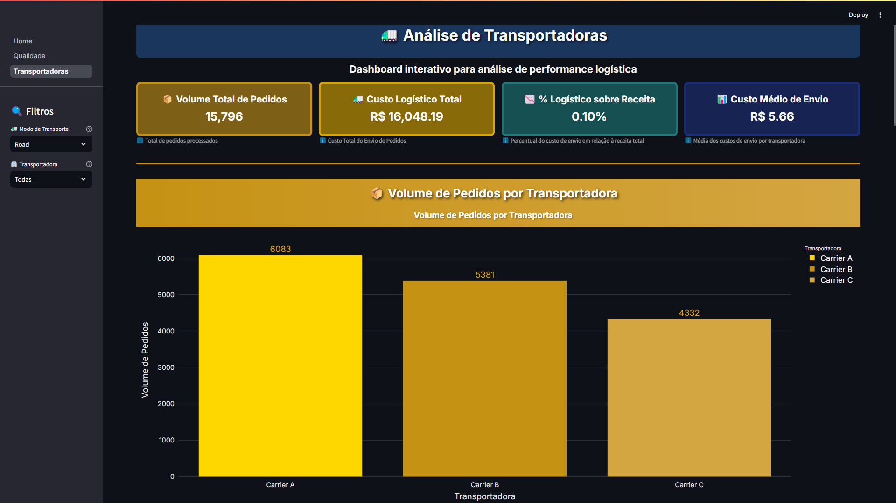
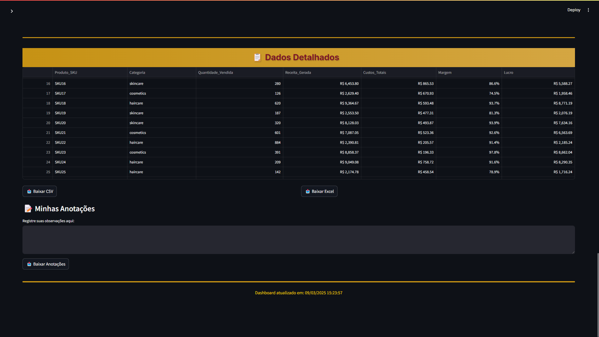
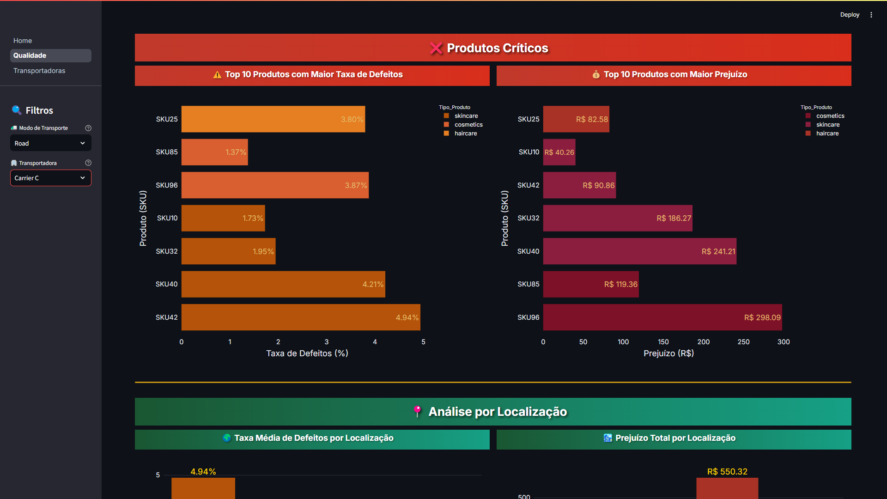
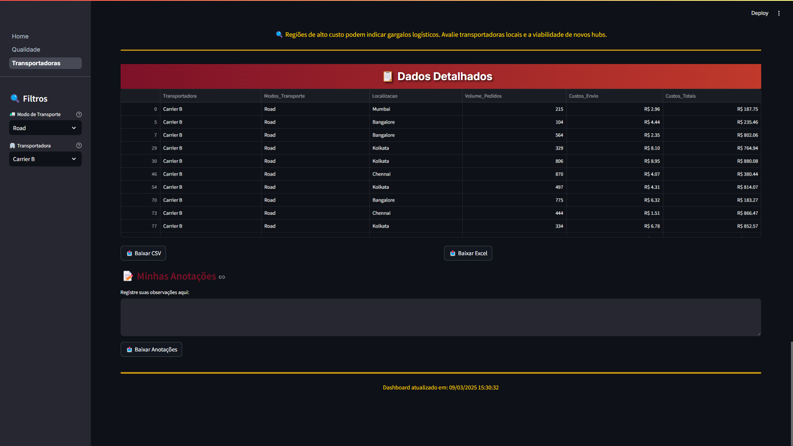
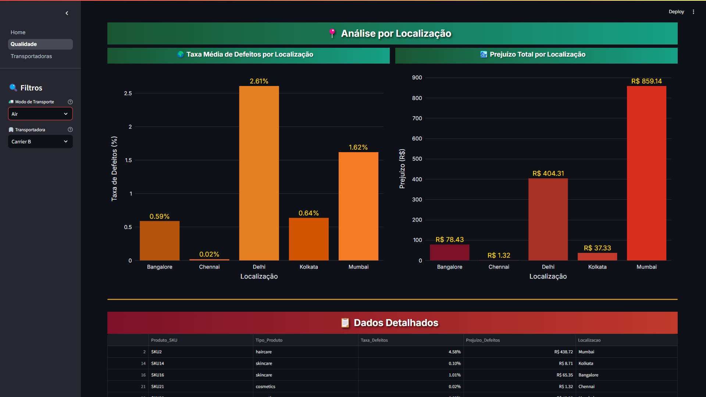
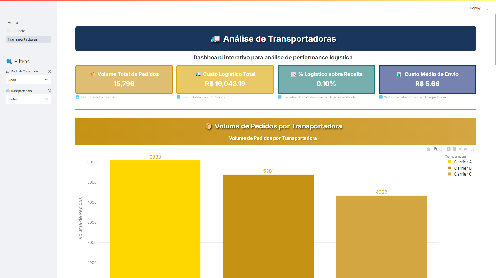

# 📊 Supply Chain Dashboard  

🔍 **Visão Geral**  

O **Dashboard de Supply Chain** é uma ferramenta interativa desenvolvida para fornecer insights acionáveis sobre a cadeia de suprimentos, permitindo a análise de qualidade, eficiência logística e desempenho de transportadoras.

Com um design refinado e Dark Mode otimizado, a solução permite tomadas de decisões estratégicas baseadas em dados, reduzindo custos e melhorando a eficiência operacional.

---

## 🚀 Tecnologias Utilizadas  

- **[Streamlit](https://streamlit.io/)** → Interface interativa e responsiva  
- **[Plotly](https://plotly.com/python/)** → Visualizações de dados dinâmicas  
- **[Pandas](https://pandas.pydata.org/)** → Manipulação e análise de dados  

---

## 🎯 Destaques do Projeto  

- **Interface Organizada** por Cadeia de Suprimento, Qualidade e Transportadoras
-  **Dark Mode** otimizado para melhor experiência visual
-  **KPIs Estratégicos** com insights rápidos
-  **Visualizações Impactantes** para análise de qualidade e logística
-  **Filtros Interativos** para segmentação dos dados
-  Foco em Usabilidade com **layout responsivo e intuitivo**

---

 ## 📸 Dashboard em Ação  
<div align="center">
  
  
 
  
  
  
  
  
  
  

</div>

---

## 🛠 Como Rodar o Projeto  

### **1️⃣ Clone o Repositório:**  
```bash
python -m venv venv
source venv/bin/activate  # No Windows: venv\Scripts\activate
pip install -r requirements.txt
```

### **2️⃣ Crie um Ambiente Virtual e Instale as Dependências:**  
```bash
source venv/bin/activate  # No Windows: venv\Scripts\activate
pip install -r requirements.txt
```

### **3️⃣ Execute o Dashboard:**  
```bash
streamlit run home.py
```

---
### 📌 Melhorias Futuras
- Integração com APIs para dados em tempo real.
- Expansão da análise para fornecedores e estoque.

---
### 📍 Observação


⚠️ O código contém uma versão demonstrativa do dashboard. A versão completa inclui mais análises e interatividade como visto nas imagens.


